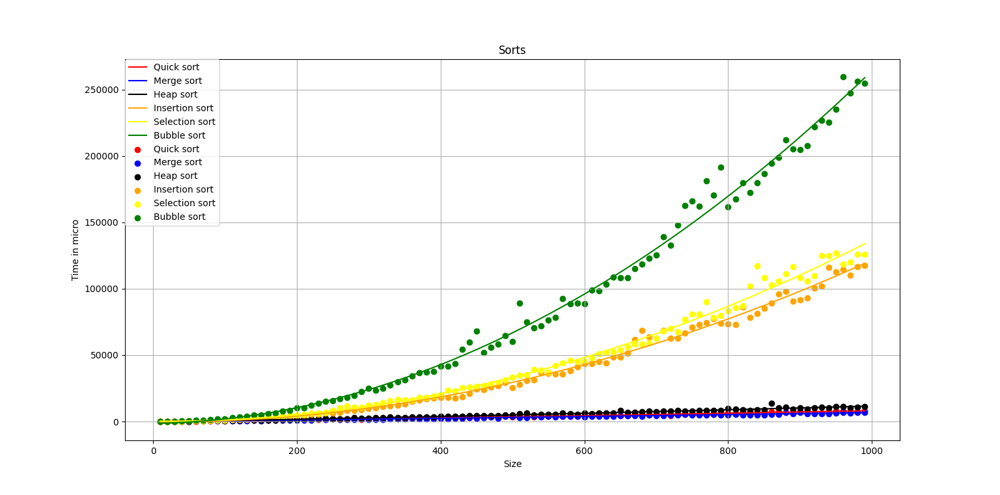

# Sorting algorithms in python

  We implemented in this project six sorting algorithms **quick sort**, **merge sort**, **heap sort**, **insertion sort**, **selection sort**, and **bubble sort**. 
  Note that to use these functions it requires operator overloading to the `-` operator. 
  We also implemented a benchmark function that takes sort function and an array, then it will  calculate and return the total time that the sort function took in seconds. 
  Finally, we implemented a function that takes points and fits a second order curve between them to visualize the sorting algorithm complexity.

## Complexity graph
  